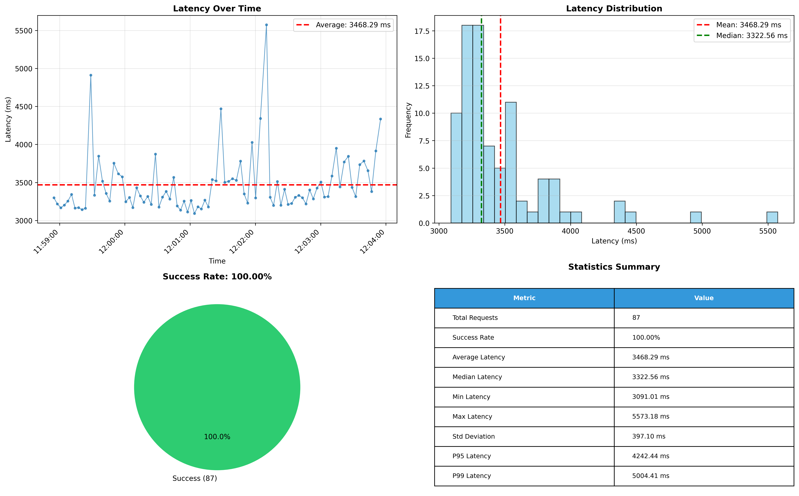

# DTrace - Application Monitoring & Performance Analysis

A comprehensive project for monitoring application performance, analyzing CPU contention using DTrace/SystemTap, and visualizing monitoring data with automated plotting.

## Features

- **Flask Application Monitoring**: Monitor API endpoints with automatic retry logic and performance tracking
- **Automated Data Collection**: Collect latency, success rates, and status codes over time
- **Data Visualization**: Generate comprehensive plots and graphs from monitoring data
- **DTrace/SystemTap Integration**: Analyze system-level performance with kernel tracing
- **SQLite & CSV Storage**: Store monitoring data in both database and CSV formats

## Prerequisites

- Python 3.x
- pip (Python package manager)
- Linux system (Ubuntu 22.04 recommended) - for DTrace/SystemTap features
- SystemTap/bpftrace installed (for Linux tracing)
- Git

## Setup on Linux


### Install bpftrace
```bash
sudo apt update
sudo apt install -y bpftrace linux-headers-$(uname -r)
```

### Clone and Run

```bash
# Clone the repository
git clone https://github.com/khangpt2k6/SimpleDTrace SimpleDTrace
cd SimpleDTrace

# Install python and virtual environment for Python
sudo apt install python3-venv -y

# Create the virtual environment 
python3 -m venv venv

# Activate the virtual environment 
source venv/bin/activate

# Install Python dependencies
pip install -r requirements.txt
# Or use: python -m pip install -r requirements.txt (if pip launcher has issues)
```


## Application Monitoring & Visualization

### Running the Flask Application

The Flask app (`app.py`) provides a `/process` endpoint that makes chained API calls with retry logic:

```bash
# Start the Flask application
python app.py
# The app will run on http://localhost:5000
```

### Monitoring the Application

The `monitor.py` script automatically monitors the Flask application and collects performance data:

```bash
# Run the monitoring script (will automatically clear old data)
python monitor.py
```

**What it does:**
- Makes requests to `http://localhost:5000/process` every 0.3 seconds
- Runs for 5 minutes (300 seconds) by default
- Collects: timestamp, latency (ms), success status, HTTP status codes
- Stores data in both `monitor_log.csv` and SQLite database (`monitor_stats` table)
- Automatically clears old data before starting a new monitoring session
- Prints summary statistics at the end

**Configuration** (in `monitor.py`):
- `DURATION = 300` - Monitoring duration in seconds
- `INTERVAL = 0.3` - Seconds between requests
- `URL = 'http://localhost:5000/process'` - Endpoint to monitor

### Generating Visualizations

After collecting monitoring data, generate comprehensive plots:

```bash
# Generate plots from monitor_log.csv
python plot_monitor.py
```

**Output:**
- Creates `monitor_plots.png` with 4 visualizations:
  1. **Time Series Plot**: Latency over time with average line
  2. **Histogram**: Latency distribution with mean/median markers
  3. **Success Rate Pie Chart**: Success vs failure percentage
  4. **Statistics Table**: Comprehensive metrics (mean, median, min, max, std dev, P95, P99)
- Displays plots on screen
- Prints summary statistics to console

**Example Visualization:**



### Data Management

**Clearing Old Data:**
- The `monitor.py` script automatically clears old data before each run
- To manually clear data:
  - Delete `monitor_log.csv` file
  - Clear database tables using SQLite tools or by deleting `database.db`

**Data Storage:**
- **CSV**: `monitor_log.csv` - Easy to import into Excel, pandas, etc.
- **SQLite**: `database.db` - Contains `monitor_stats`, `logs`, `api_calls`, and `users` tables

## CPU and Memory Limits (Optional)

To simulate resource constraints, you can use cgroups or Docker:

```bash
# Using Docker with resource limits
docker run -it --privileged --cpus=0.5 -m 512m ubuntu:22.04 /bin/bash
```

## Running Tests

```bash
# Run all tests
pytest

# Run tests with coverage report
pytest --cov=. --cov-report=html

# Run specific test file
pytest tests/test_app.py

# Run with verbose output
pytest -v
```

### DTrace/SystemTap Scripts

**Try running one script first. If it works, you can run the others:**

```bash
# Start Flask app first (in one terminal)
python app.py

# Then run SystemTap tracing (in another terminal)
sudo bpftrace dtrace_scripts/syscalls.d

# Other available scripts:
sudo bpftrace dtrace_scripts/io_analysis.d
sudo bpftrace dtrace_scripts/process_info.d
sudo bpftrace dtrace_scripts/cpu_usage.d
```
## Quick Start Workflow

1. **Install dependencies:**
   ```bash
   python -m pip install -r requirements.txt
   ```

2. **Start Flask app:**
   ```bash
   python app.py
   ```

3. **In another terminal, run monitoring:**
   ```bash
   python monitor.py
   ```

4. **Generate visualizations:**
   ```bash
   python plot_monitor.py
   ```

5. **View results:**
   - Check `monitor_log.csv` for raw data
   - Open `monitor_plots.png` for visualizations
   - Review console output for statistics summary
